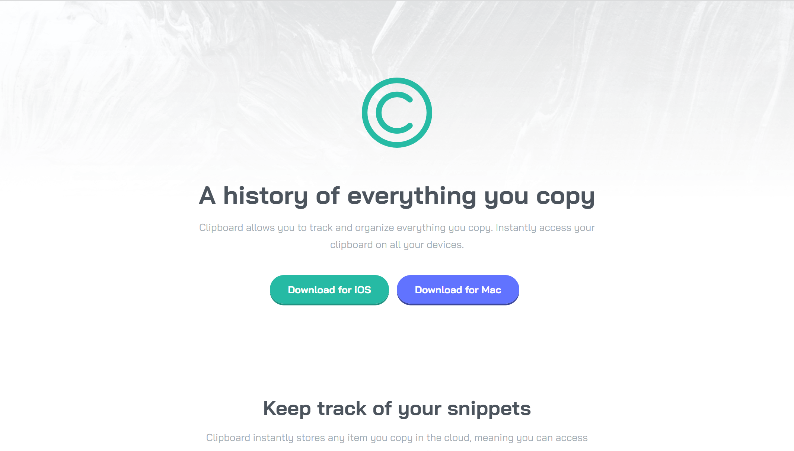

## Welcome! 👋

Thanks for checking out My front end Second Challenge I hope You like it

## Overview

### The challenge

The Challenge is to build a landing page 

### Screenshot

This is a screenshot of my front end landing page you can see it 

### Links 

- Challenge URL: [Click Here](https://www.frontendmentor.io/challenges/clipboard-landing-page-5cc9bccd6c4c91111378ecb9)
- Live Site URL: [Click Here](-)   

## My Progress

### Building your project

- Semantic HTML5 markup
- CSS
- SCSS
- Flexbox
- Responsed Mobile view

### What I learned 

I enjoyed programming this website specially coding the responsive design 
for mobile in this website was very good and I learned a lot  

## Author 

- My Website (Soon will be open now it is not available sorry!) - [Mugendai](https://Mugendai.io)  

